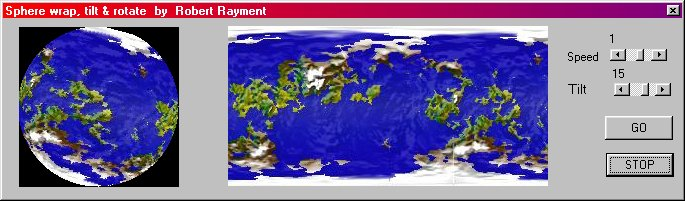



## Sphere \(Updated\)

### Description

Sphere by Robert Rayment. (Update with Latitude shift & Long for Byte Array) Demo of spherical wrap, rotate and tilt. Win98 (Zip 21 KB).
 
### More Info
 
a jpg

Just run the demo

             |
---                |---
**Submitted On**   |2002-12-26 07:17:02
**By**             |[Robert Rayment](https://github.com/Planet-Source-Code/PSCIndex/blob/master/ByAuthor/robert-rayment.md)
**Level**          |Intermediate
**User Rating**    |4.9 (103 globes from 21 users)
**Compatibility**  |VB 6\.0
**Category**       |[Graphics](https://github.com/Planet-Source-Code/PSCIndex/blob/master/ByCategory/graphics__1-46.md)
**World**          |[Visual Basic](https://github.com/Planet-Source-Code/PSCIndex/blob/master/ByWorld/visual-basic.md)
**Archive File**   |[Sphere\_\(Up155706392003\.zip](https://github.com/Planet-Source-Code/robert-rayment-sphere-updated__1-42766/archive/master.zip)

### API Declarations

A few see code

